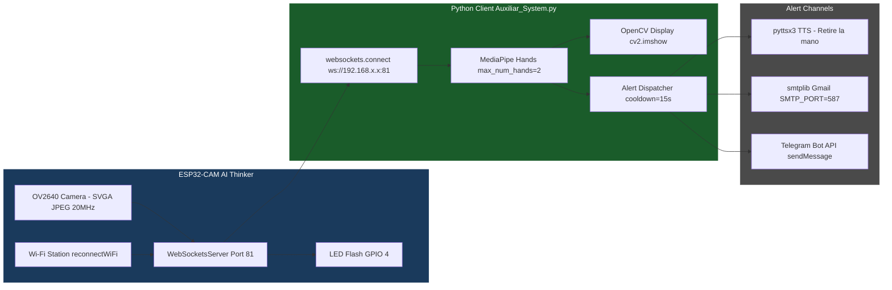
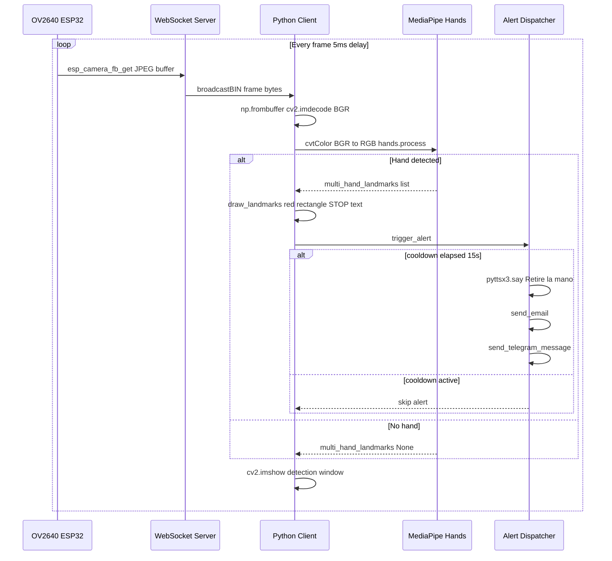
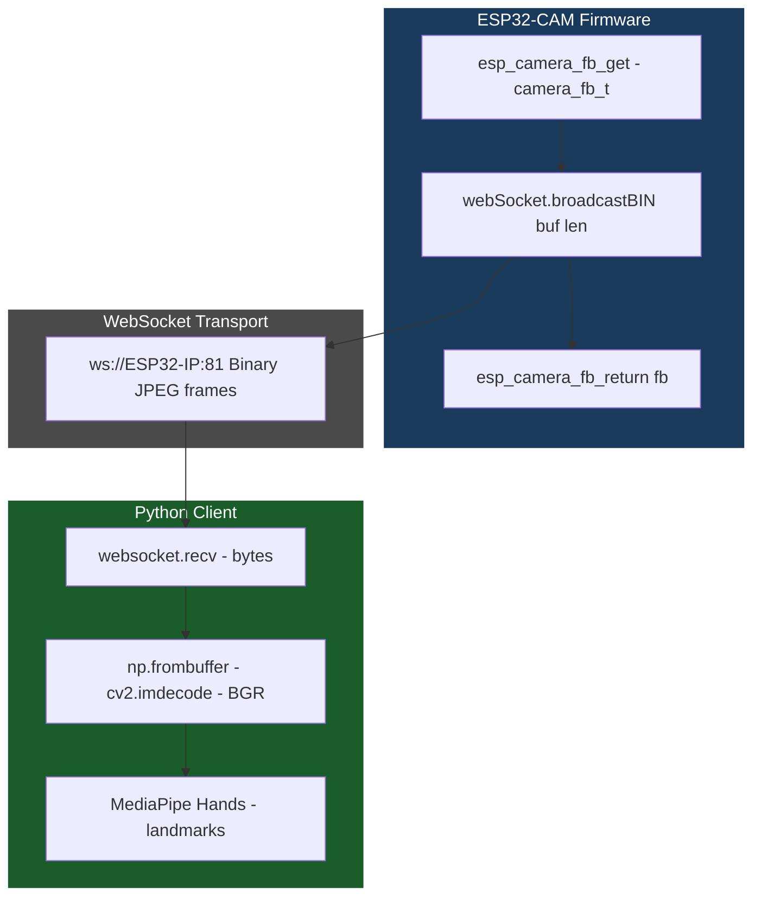
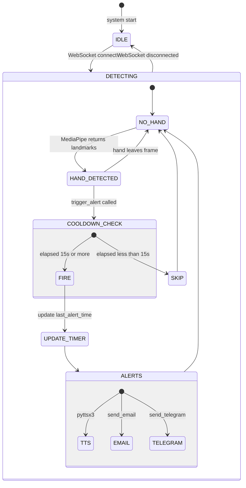
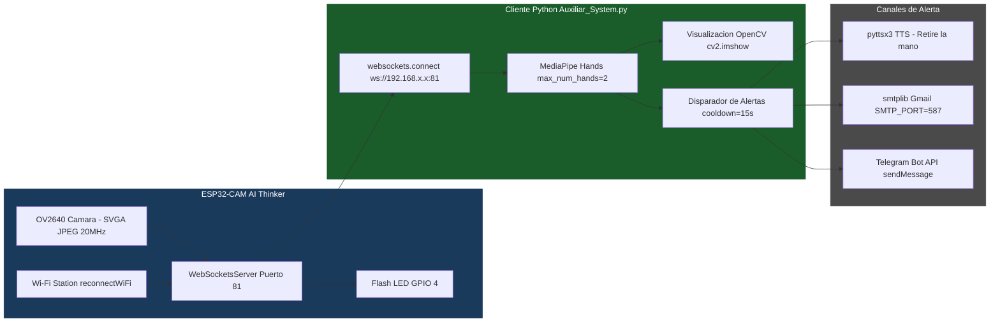
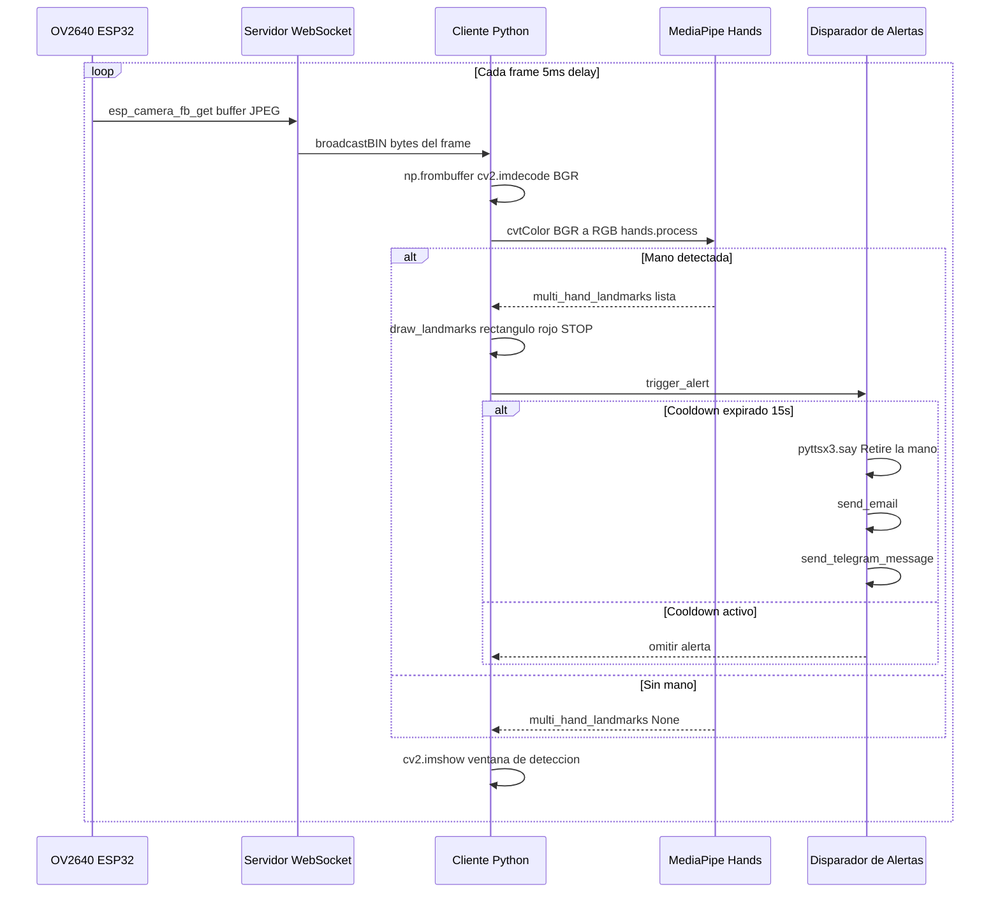
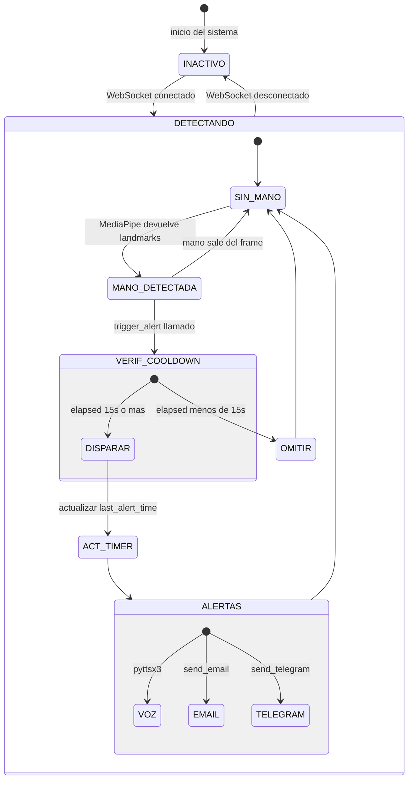

# ESP32-CAM Hand Detection Safety System

<div align="center">


**Safety System — Real-Time Hand Detection**
ESP32-CAM · WebSocket · MediaPipe · Multi-Channel Alerts

**English** | [Español](#sistema-de-deteccion-de-manos-con-esp32-cam--seguridad)

<br/>


> *ESP32-CAM AI Thinker module used as the video capture and WebSocket streaming unit in the safety system.*

> 🔗 **This repository is an auxiliary safety subsystem applied to the following project:**
> **[jorgefajardom-coder/drone-packaging-simulation-unity](https://github.com/jorgefajardom-coder/drone-packaging-simulation-unity)**
> *Unity-based simulation of a robotic drone assembly cell with articulated arms, C# control systems, JSON-driven motion sequences, gripper and suction tools, multi-arm coordination, and virtual process validation. Focused on robotics, automation, industrial workflows, and realistic interaction between components and mechanisms.*

</div>

---

## Table of Contents

- [Overview](#overview)
- [System Architecture](#system-architecture)
- [Technical Stack](#technical-stack)
- [Communication Protocol](#communication-protocol)
- [Alert System](#alert-system)
- [Project Structure](#project-structure)
- [Installation](#installation)
- [Configuration](#configuration)
- [Authors](#authors)
- [License and Rights](#license-and-rights)

> **2 source files · ESP32-CAM firmware (Arduino/C++) · Python client with MediaPipe**

---

## Overview

This project implements a **real-time hand detection safety system** for robotic cells. An **ESP32-CAM AI Thinker** module captures and streams live video over **WebSocket** to a Python client that runs **MediaPipe Hands** for detection. When a hand is detected inside the robot work area, the system triggers a **multi-channel alert** — voice synthesis, email, and Telegram — with a configurable cooldown to prevent alert flooding.

The system is designed as an **auxiliary safety layer** for the robotic drone assembly and palletizing cell of the following project, where it was applied:

> 🔗 **[jorgefajardom-coder/drone-packaging-simulation-unity](https://github.com/jorgefajardom-coder/drone-packaging-simulation-unity)**
> *Unity-based simulation of a robotic drone assembly cell with articulated arms, C# control systems, JSON-driven motion sequences, gripper and suction tools, multi-arm coordination, and virtual process validation. Focused on robotics, automation, industrial workflows, and realistic interaction between components and mechanisms.*

It provides physical-layer operator protection complementary to the CODESYS/FluidSIM automation layer of that project.

### Key Features

- 📷 **ESP32-CAM AI Thinker** — SVGA JPEG stream at 20 MHz XCLK over WebSocket port 81
- 🔌 **WebSocket transport** — binary frame broadcast, auto-reconnect on Wi-Fi loss
- 🤚 **MediaPipe Hands** — up to 2 hands, 0.5 detection/tracking confidence, real-time landmark overlay
- 🔴 **Visual alert** — red bounding rectangle + STOP overlay on detection frame
- 🔊 **Voice alert** — `pyttsx3` TTS (Spanish, Sabina voice) announces "Retire la mano"
- 📧 **Email alert** — SMTP/Gmail notification on detection
- 📱 **Telegram alert** — Bot API message to configured chat ID
- ⏱️ **Cooldown system** — 15-second inter-alert delay to prevent alert flooding
- 💡 **LED status indicator** — GPIO 4 flash blinks encode connection state (2 blinks = connected/disconnected, 3 blinks = client connected)

---

## System Architecture

### Component Diagram



### Detection Flow



---

## Technical Stack

### ESP32-CAM Firmware (`ESP32CAM.ino`)

| Component | Detail |
|-----------|--------|
| **Board** | AI Thinker ESP32-CAM |
| **Camera sensor** | OV2640 |
| **Frame size** | `FRAMESIZE_SVGA` (800x600) |
| **Pixel format** | `PIXFORMAT_JPEG` |
| **JPEG quality** | 10 (lower = higher quality) |
| **Frame buffers** | 2 (double buffering) |
| **XCLK frequency** | 20 MHz |
| **WebSocket library** | `arduinoWebSockets` (Markus Sattler) |
| **WebSocket port** | 81 |
| **Loop delay** | 5 ms |

**Camera pin mapping (AI Thinker):**

| Signal | GPIO |
|--------|------|
| PWDN | 32 |
| XCLK | 0 |
| SIOD SDA | 26 |
| SIOC SCL | 27 |
| Y9-Y2 | 35, 34, 39, 36, 21, 19, 18, 5 |
| VSYNC | 25 |
| HREF | 23 |
| PCLK | 22 |
| LED Flash | 4 |

### Python Client (`Auxiliar_System.py`)

| Library | Version | Purpose |
|---------|---------|---------|
| `opencv-python` | >=4.5 | Frame decoding, display, overlay drawing |
| `websockets` | >=10.0 | Async WebSocket client |
| `numpy` | >=1.21 | Binary buffer to array conversion |
| `mediapipe` | >=0.9 | Hand landmark detection |
| `pyttsx3` | >=2.90 | Offline TTS voice alert |
| `smtplib` | stdlib | Email alert via Gmail SMTP |
| `requests` | >=2.28 | Telegram Bot API calls |
| `python-dotenv` | >=0.19 | Environment variable loading from .env |

---

## Communication Protocol

The ESP32-CAM and the Python client communicate exclusively over **WebSocket (RFC 6455)** using binary frames.



**LED status encoding (GPIO 4):**

| Event | Blink pattern |
|-------|--------------|
| Wi-Fi connected | 2 blinks (200ms ON / 1000ms OFF) |
| WebSocket client disconnected | 2 blinks |
| WebSocket client connected | 3 blinks |

**Wi-Fi auto-reconnect:**

```cpp
void reconnectWiFi() {
    if (WiFi.status() != WL_CONNECTED) {
        WiFi.disconnect();
        WiFi.begin(ssid, password);
        while (WiFi.status() != WL_CONNECTED) {
            delay(500);
        }
    }
}
```

---

## Alert System

All three alert channels share a single **cooldown timer** (`ALERT_COOLDOWN = 15` seconds) stored in `last_alert_time`. Only one alert burst fires per detection window.



### Email Alert (`send_email`)

- **SMTP server:** `smtp.gmail.com:587` with STARTTLS
- **Subject:** `"Alerta: Mano Detectada"`
- **Body:** `"Brazo #1 detecto la mano de un operario."`
- Credentials loaded from `.env` — never hardcoded

### Telegram Alert (`send_telegram_message`)

- **API:** `https://api.telegram.org/bot{TOKEN}/sendMessage`
- **Message:** `"Alerta: Mano detectada en el area de trabajo. Retire la mano."`
- **Timeout:** 5 seconds per request

### Voice Alert (`pyttsx3`)

- Offline TTS — no internet required
- Target voice: `TTS_MS_ES-MX_SABINA_11.0` (Spanish/MX)
- Falls back to system default voice if Sabina is not installed

---

## Project Structure

```
esp32cam-hand-detection-safety-system/
├── docs/
│   └── system_overview.jpg              # ESP32-CAM hardware photo
├── ESP32CAM.ino                         # ESP32-CAM firmware - WebSocket server + camera stream
├── Auxiliar_System.py                   # Python client - MediaPipe detection + alert dispatcher
├── arduinoWebSockets-master.zip         # WebSocket library for Arduino (Markus Sattler)
├── .env.example                         # Environment variable template (credentials)
├── requirements.txt                     # Python dependencies
└── README.md
```

---

## Installation

### Prerequisites

- **Arduino IDE** 1.8.x or 2.x
- **Python** 3.9 or higher
- **Git** (to clone the repository)
- **Gmail account** with App Password enabled (for email alerts)
- **Telegram Bot** created via [@BotFather](https://t.me/BotFather) (for Telegram alerts)
- **OS:** Windows 10/11, macOS 10.15+, or Ubuntu 20.04+

### 1. Clone the Repository

```bash
git clone https://github.com/jorgefajardom-coder/esp32cam-hand-detection-safety-system.git
cd esp32cam-hand-detection-safety-system
```

### 2. Flash the ESP32-CAM Firmware

**Arduino IDE dependencies (`ESP32CAM.ino`):**

| Dependency | Version | How to install |
|------------|---------|----------------|
| **ESP32 board support** | >=2.0.0 | Boards Manager — search `esp32` by Espressif Systems |
| **esp_camera** | bundled with ESP32 core | Included automatically with ESP32 board package |
| **WiFi.h** | bundled with ESP32 core | Included automatically with ESP32 board package |
| **WebSocketsServer** | arduinoWebSockets (Markus Sattler) | Add `.ZIP` library — see step 1 below |

1. Add the ESP32 board URL in **File → Preferences → Additional Boards Manager URLs**:
   ```
   https://raw.githubusercontent.com/espressif/arduino-esp32/gh-pages/package_esp32_index.json
   ```
   Then: **Tools → Boards Manager** → search `esp32` → install by **Espressif Systems**

2. Install the WebSocket library:
   - **Sketch → Include Library → Add .ZIP Library**
   - Select `arduinoWebSockets-master.zip`

3. Open `ESP32CAM.ino` and set your Wi-Fi credentials:
   ```cpp
   const char* ssid = "YOUR_SSID";
   const char* password = "YOUR_PASSWORD";
   ```

4. Select board: **Tools → Board → AI Thinker ESP32-CAM**

5. Upload and note the IP shown in Serial Monitor at 115200 baud:
   ```
   Direccion IP de la ESP32-CAM: 192.168.x.x
   Servidor WebSocket iniciado
   ```

### 3. Set Up the Python Client

```bash
pip install -r requirements.txt
```

**`requirements.txt`:**
```
opencv-python>=4.5
websockets>=10.0
numpy>=1.21
mediapipe>=0.9
pyttsx3>=2.90
requests>=2.28
python-dotenv>=0.19
```

### 4. Configure Environment Variables

```bash
cp .env.example .env
```

```env
EMAIL_ADDRESS=your_email@gmail.com
EMAIL_PASSWORD=your_app_password
TO_EMAIL=recipient@email.com

TELEGRAM_BOT_TOKEN=your_bot_token
TELEGRAM_CHAT_ID=your_chat_id

WEBSOCKET_URL=ws://192.168.x.x:81
```

> Never commit `.env` to version control. It is listed in `.gitignore`.

### 5. Run

```bash
python Auxiliar_System.py
```

The detection window opens automatically. Press **`q`** to quit.

---

## Configuration

### Detection Parameters

| Parameter | Location | Default | Description |
|-----------|----------|---------|-------------|
| `max_num_hands` | `Auxiliar_System.py` | `2` | Maximum hands tracked simultaneously |
| `min_detection_confidence` | `Auxiliar_System.py` | `0.5` | Minimum detection confidence threshold |
| `min_tracking_confidence` | `Auxiliar_System.py` | `0.5` | Minimum tracking confidence threshold |
| `ALERT_COOLDOWN` | `Auxiliar_System.py` | `15` | Seconds between alert bursts |

### Camera Parameters

| Parameter | Location | Default | Description |
|-----------|----------|---------|-------------|
| `frame_size` | `ESP32CAM.ino` | `FRAMESIZE_SVGA` | Frame resolution (800x600) |
| `jpeg_quality` | `ESP32CAM.ino` | `10` | JPEG quality (1=best, 63=worst) |
| `fb_count` | `ESP32CAM.ino` | `2` | Frame buffer count |
| `xclk_freq_hz` | `ESP32CAM.ino` | `20000000` | Camera clock (20 MHz) |
| `delay()` | `ESP32CAM.ino` | `5` ms | Loop delay between frames |

---

## Authors

**Jorge Andres Fajardo Mora**
**Laura Vanesa Castro Sierra**

---

## License and Rights

**Copyright 2026 Jorge Andres Fajardo Mora and Laura Vanesa Castro Sierra. All rights reserved.**

This repository and all its contents — including but not limited to source code, scripts, configuration files, and documentation — are provided for **read-only and reference purposes only**.

**No permission is granted** to copy, modify, distribute, sublicense, or use any part of this project for commercial or non-commercial purposes without **explicit written authorization** from both authors.

**Unauthorized reproduction or redistribution** of this work, in whole or in part, is **strictly prohibited**.

---
---
---

# Sistema de Deteccion de Manos con ESP32-CAM — Seguridad

<div align="center">


**Sistema de Seguridad — Deteccion de Manos en Tiempo Real**
ESP32-CAM · WebSocket · MediaPipe · Alertas Multicanal

[English](#esp32-cam-hand-detection-safety-system) | **Español**

<br/>


> *Modulo ESP32-CAM AI Thinker utilizado como unidad de captura de video y streaming WebSocket en el sistema de seguridad.*

> 🔗 **Este repositorio es un subsistema auxiliar de seguridad aplicado al siguiente proyecto:**
> **[jorgefajardom-coder/drone-packaging-simulation-unity](https://github.com/jorgefajardom-coder/drone-packaging-simulation-unity)**
> *Simulacion en Unity de una celda robotica de ensamblaje de drones con brazos articulados, sistemas de control en C#, secuencias de movimiento impulsadas por JSON, herramientas de gripper y ventosa, coordinacion multi-brazo y validacion virtual de procesos. Enfocada en robotica, automatizacion, flujos de trabajo industriales e interaccion realista entre componentes y mecanismos.*

</div>

---

## Tabla de Contenidos

- [Descripcion General](#descripcion-general)
- [Arquitectura del Sistema](#arquitectura-del-sistema)
- [Stack Tecnico](#stack-tecnico)
- [Protocolo de Comunicacion](#protocolo-de-comunicacion)
- [Sistema de Alertas](#sistema-de-alertas)
- [Estructura del Proyecto](#estructura-del-proyecto)
- [Instalacion](#instalacion)
- [Configuracion](#configuracion)
- [Autores](#autores)
- [Licencia y Derechos](#licencia-y-derechos)

> **2 archivos fuente · Firmware ESP32-CAM (Arduino/C++) · Cliente Python con MediaPipe**

---

## Descripcion General

Este proyecto implementa un **sistema de seguridad de deteccion de manos en tiempo real** para celdas roboticas. Un modulo **ESP32-CAM AI Thinker** captura y transmite video en vivo sobre **WebSocket** a un cliente Python que ejecuta **MediaPipe Hands** para la deteccion. Cuando se detecta una mano dentro del area de trabajo del robot, el sistema dispara una **alerta multicanal** — sintesis de voz, correo electronico y Telegram — con un cooldown configurable para evitar saturacion de alertas.

El sistema esta disenado como una **capa de seguridad auxiliar** para la celda robotica de ensamblaje y paletizado de drones del siguiente proyecto, donde fue aplicado:

> 🔗 **[jorgefajardom-coder/drone-packaging-simulation-unity](https://github.com/jorgefajardom-coder/drone-packaging-simulation-unity)**
> *Simulacion en Unity de una celda robotica de ensamblaje de drones con brazos articulados, sistemas de control en C#, secuencias de movimiento impulsadas por JSON, herramientas de gripper y ventosa, coordinacion multi-brazo y validacion virtual de procesos. Enfocada en robotica, automatizacion, flujos de trabajo industriales e interaccion realista entre componentes y mecanismos.*

Proporciona proteccion fisica al operario complementaria a la capa de automatizacion CODESYS/FluidSIM de ese proyecto.

### Caracteristicas Clave

- 📷 **ESP32-CAM AI Thinker** — Stream JPEG SVGA a 20 MHz XCLK por WebSocket puerto 81
- 🔌 **Transporte WebSocket** — broadcast de frames binarios, reconexion automatica por perdida de Wi-Fi
- 🤚 **MediaPipe Hands** — hasta 2 manos, confianza 0.5 deteccion/seguimiento, overlay de landmarks en tiempo real
- 🔴 **Alerta visual** — rectangulo delimitador rojo + overlay STOP en el frame de deteccion
- 🔊 **Alerta de voz** — TTS `pyttsx3` (Espanol, voz Sabina) anuncia "Retire la mano"
- 📧 **Alerta por email** — notificacion SMTP/Gmail en deteccion
- 📱 **Alerta por Telegram** — mensaje a traves de Bot API al chat ID configurado
- ⏱️ **Sistema de cooldown** — 15 segundos entre alertas para evitar saturacion
- 💡 **Indicador LED de estado** — flash GPIO 4 codifica estado de conexion (2 parpadeos = conectado/desconectado, 3 parpadeos = cliente conectado)

---

## Arquitectura del Sistema

### Diagrama de Componentes



### Flujo de Deteccion



---

## Stack Tecnico

### Firmware ESP32-CAM (`ESP32CAM.ino`)

| Componente | Detalle |
|------------|---------|
| **Placa** | AI Thinker ESP32-CAM |
| **Sensor de camara** | OV2640 |
| **Tamano de frame** | `FRAMESIZE_SVGA` (800x600) |
| **Formato de pixel** | `PIXFORMAT_JPEG` |
| **Calidad JPEG** | 10 (menor = mayor calidad) |
| **Buffers de frame** | 2 (doble buffer) |
| **Frecuencia XCLK** | 20 MHz |
| **Libreria WebSocket** | `arduinoWebSockets` (Markus Sattler) |
| **Puerto WebSocket** | 81 |
| **Delay de loop** | 5 ms |

**Mapa de pines de camara (AI Thinker):**

| Senal | GPIO |
|-------|------|
| PWDN | 32 |
| XCLK | 0 |
| SIOD SDA | 26 |
| SIOC SCL | 27 |
| Y9-Y2 | 35, 34, 39, 36, 21, 19, 18, 5 |
| VSYNC | 25 |
| HREF | 23 |
| PCLK | 22 |
| Flash LED | 4 |

### Cliente Python (`Auxiliar_System.py`)

| Libreria | Version | Proposito |
|----------|---------|-----------|
| `opencv-python` | >=4.5 | Decodificacion de frames, visualizacion, overlay |
| `websockets` | >=10.0 | Cliente WebSocket asincrono |
| `numpy` | >=1.21 | Conversion buffer binario a array |
| `mediapipe` | >=0.9 | Deteccion de landmarks de manos |
| `pyttsx3` | >=2.90 | TTS offline para alerta de voz |
| `smtplib` | stdlib | Alerta por email via Gmail SMTP |
| `requests` | >=2.28 | Llamadas a Telegram Bot API |
| `python-dotenv` | >=0.19 | Carga de variables de entorno desde .env |

---

## Protocolo de Comunicacion

La ESP32-CAM y el cliente Python se comunican exclusivamente sobre **WebSocket (RFC 6455)** usando frames binarios.


**Codificacion de estado LED (GPIO 4):**

| Evento | Patron de parpadeo |
|--------|-------------------|
| Wi-Fi conectado | 2 parpadeos (200ms ON / 1000ms OFF) |
| Cliente WebSocket desconectado | 2 parpadeos |
| Cliente WebSocket conectado | 3 parpadeos |

**Reconexion automatica Wi-Fi:**

```cpp
void reconnectWiFi() {
    if (WiFi.status() != WL_CONNECTED) {
        WiFi.disconnect();
        WiFi.begin(ssid, password);
        while (WiFi.status() != WL_CONNECTED) {
            delay(500);
        }
    }
}
```

---

## Sistema de Alertas

Los tres canales de alerta comparten un unico **temporizador de cooldown** (`ALERT_COOLDOWN = 15` segundos) almacenado en `last_alert_time`. Solo una rafaga de alertas se dispara por ventana de deteccion.



### Alerta por Email (`send_email`)

- **Servidor SMTP:** `smtp.gmail.com:587` con STARTTLS
- **Asunto:** `"Alerta: Mano Detectada"`
- **Cuerpo:** `"Brazo #1 detecto la mano de un operario."`
- Credenciales cargadas desde `.env` — nunca en el codigo fuente

### Alerta por Telegram (`send_telegram_message`)

- **API:** `https://api.telegram.org/bot{TOKEN}/sendMessage`
- **Mensaje:** `"Alerta: Mano detectada en el area de trabajo. Retire la mano."`
- **Timeout:** 5 segundos por solicitud

### Alerta de Voz (`pyttsx3`)

- TTS offline — no requiere conexion a internet
- Voz objetivo: `TTS_MS_ES-MX_SABINA_11.0` (Espanol/MX)
- Cae al sistema de voz por defecto si Sabina no esta instalada

---

## Estructura del Proyecto

```
esp32cam-hand-detection-safety-system/
├── docs/
│   └── system_overview.jpg              # Foto del hardware ESP32-CAM
├── ESP32CAM.ino                         # Firmware ESP32-CAM - servidor WebSocket + stream de camara
├── Auxiliar_System.py                   # Cliente Python - deteccion MediaPipe + disparador de alertas
├── arduinoWebSockets-master.zip         # Libreria WebSocket para Arduino (Markus Sattler)
├── .env.example                         # Plantilla de variables de entorno (credenciales)
├── requirements.txt                     # Dependencias Python
└── README.md
```

---

## Instalacion

### Requisitos Previos

- **Arduino IDE** 1.8.x o 2.x
- **Python** 3.9 o superior
- **Git** (para clonar el repositorio)
- **Cuenta Gmail** con App Password habilitada (para alertas por email)
- **Bot de Telegram** creado via [@BotFather](https://t.me/BotFather) (para alertas por Telegram)
- **SO:** Windows 10/11, macOS 10.15+, o Ubuntu 20.04+

### 1. Clonar el Repositorio

```bash
git clone https://github.com/jorgefajardom-coder/esp32cam-hand-detection-safety-system.git
cd esp32cam-hand-detection-safety-system
```

### 2. Flashear el Firmware ESP32-CAM

**Dependencias de Arduino IDE (`ESP32CAM.ino`):**

| Dependencia | Version | Como instalar |
|-------------|---------|---------------|
| **Soporte de placa ESP32** | >=2.0.0 | Boards Manager — buscar `esp32` de Espressif Systems |
| **esp_camera** | incluida con el core ESP32 | Se incluye automaticamente con el paquete de placa ESP32 |
| **WiFi.h** | incluida con el core ESP32 | Se incluye automaticamente con el paquete de placa ESP32 |
| **WebSocketsServer** | arduinoWebSockets (Markus Sattler) | Agregar libreria `.ZIP` — ver paso 1 abajo |

1. Agregar la URL del paquete ESP32 en **Archivo → Preferencias → URLs adicionales para el gestor de placas**:
   ```
   https://raw.githubusercontent.com/espressif/arduino-esp32/gh-pages/package_esp32_index.json
   ```
   Luego: **Herramientas → Gestor de placas** → buscar `esp32` → instalar de **Espressif Systems**

2. Instalar la libreria WebSocket:
   - **Sketch → Include Library → Add .ZIP Library**
   - Seleccionar `arduinoWebSockets-master.zip`

3. Abrir `ESP32CAM.ino` y configurar las credenciales Wi-Fi:
   ```cpp
   const char* ssid = "TU_SSID";
   const char* password = "TU_CONTRASENA";
   ```

4. Seleccionar placa: **Tools → Board → AI Thinker ESP32-CAM**

5. Subir el firmware y anotar la IP en el Serial Monitor a 115200 baud:
   ```
   Direccion IP de la ESP32-CAM: 192.168.x.x
   Servidor WebSocket iniciado
   ```

### 3. Configurar el Cliente Python

```bash
pip install -r requirements.txt
```

**`requirements.txt`:**
```
opencv-python>=4.5
websockets>=10.0
numpy>=1.21
mediapipe>=0.9
pyttsx3>=2.90
requests>=2.28
python-dotenv>=0.19
```

### 4. Configurar Variables de Entorno

```bash
cp .env.example .env
```

```env
EMAIL_ADDRESS=tu_correo@gmail.com
EMAIL_PASSWORD=tu_app_password
TO_EMAIL=destinatario@correo.com

TELEGRAM_BOT_TOKEN=tu_token_bot
TELEGRAM_CHAT_ID=tu_chat_id

WEBSOCKET_URL=ws://192.168.x.x:81
```

> Nunca subas `.env` al control de versiones. Esta incluido en `.gitignore`.

### 5. Ejecutar

```bash
python Auxiliar_System.py
```

La ventana de deteccion se abre automaticamente. Presionar **`q`** para salir.

---

## Configuracion

### Parametros de Deteccion

| Parametro | Ubicacion | Valor por defecto | Descripcion |
|-----------|-----------|-------------------|-------------|
| `max_num_hands` | `Auxiliar_System.py` | `2` | Maximo de manos rastreadas simultaneamente |
| `min_detection_confidence` | `Auxiliar_System.py` | `0.5` | Umbral minimo de confianza de deteccion |
| `min_tracking_confidence` | `Auxiliar_System.py` | `0.5` | Umbral minimo de confianza de seguimiento |
| `ALERT_COOLDOWN` | `Auxiliar_System.py` | `15` | Segundos entre rafagas de alerta |

### Parametros de Camara

| Parametro | Ubicacion | Valor por defecto | Descripcion |
|-----------|-----------|-------------------|-------------|
| `frame_size` | `ESP32CAM.ino` | `FRAMESIZE_SVGA` | Resolucion de frame (800x600) |
| `jpeg_quality` | `ESP32CAM.ino` | `10` | Calidad JPEG (1=mejor, 63=peor) |
| `fb_count` | `ESP32CAM.ino` | `2` | Cantidad de buffers de frame |
| `xclk_freq_hz` | `ESP32CAM.ino` | `20000000` | Reloj de camara (20 MHz) |
| `delay()` | `ESP32CAM.ino` | `5` ms | Delay de loop entre frames |

---

## Autores

**Jorge Andres Fajardo Mora**
**Laura Vanesa Castro Sierra**

---

## Licencia y Derechos

**Copyright 2026 Jorge Andres Fajardo Mora y Laura Vanesa Castro Sierra. Todos los derechos reservados.**

Este repositorio y la totalidad de su contenido — incluyendo, entre otros, codigo fuente, scripts, archivos de configuracion y documentacion — se proporcionan exclusivamente para **fines de lectura y referencia**.

**No se otorga ningun permiso** para copiar, modificar, distribuir, sublicenciar ni utilizar ninguna parte de este proyecto con fines comerciales o no comerciales sin **autorizacion escrita explicita** de ambos autores.

Queda **estrictamente prohibida** la reproduccion o redistribucion no autorizada de este trabajo, en todo o en parte.
